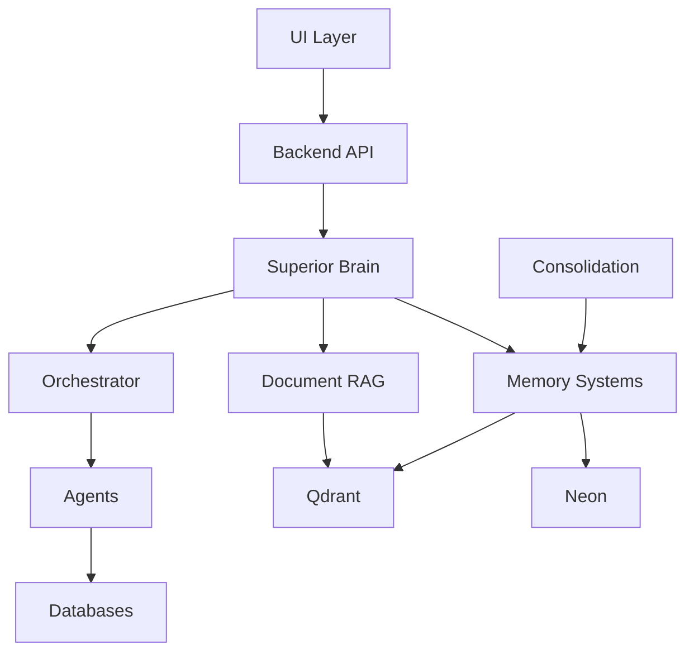

# Complete AI Brain Architecture
## Including Documents, UI, and Organization Systems

**Version:** 2.0 - Complete System
**Date:** 2025-11-19
**Status:** Implementation Ready

---

## Table of Contents
1. [Complete Architecture Overview](#complete-architecture-overview)
2. [Core Brain Components](#core-brain-components)
3. [Document System Integration](#document-system-integration)
4. [UI Communication Layer](#ui-communication-layer)
5. [Information Flow](#information-flow)
6. [Implementation Map](#implementation-map)
7. [Cross-References](#cross-references)

---

## Complete Architecture Overview

### The Full Brain System

```
┌─────────────────────────────────────────────────────────────────────────────┐
│                        COMPLETE AI BRAIN SYSTEM                              │
│                                                                               │
│  ┌──────────────────────────────────────────────────────────────────────┐   │
│  │                    HUMAN INTERFACE LAYER (Sensory I/O)                │   │
│  │  ┌────────────┬──────────────┬──────────────┬─────────────────────┐  │   │
│  │  │    UI      │   Voice      │   API        │   CLI              │  │   │
│  │  │  (Eyes)    │  (Ears)      │  (Network)   │   (Text)           │  │   │
│  │  │  Web/Chat  │  Audio I/O   │  REST/Graph  │   Terminal         │  │   │
│  │  └────────────┴──────────────┴──────────────┴─────────────────────┘  │   │
│  │  Location: ui-module/unified_agent_api.py                            │   │
│  └──────────────────────────────────────────────────────────────────────┘   │
│                                    ↕                                          │
│  ┌──────────────────────────────────────────────────────────────────────┐   │
│  │              ORCHESTRATOR (Prefrontal Cortex - Executive)             │   │
│  │  • Routes tasks to specialized agents                                 │   │
│  │  • Integrates document retrieval                                      │   │
│  │  • Coordinates multi-agent workflows                                  │   │
│  │  Location: orchestrator/orchestrator.py                               │   │
│  └────────────────────────────┬─────────────────────────────────────────┘   │
│                                ↓                                              │
│  ┌──────────────────────────────────────────────────────────────────────┐   │
│  │                   SPECIALIZED AGENTS (Brain Regions)                  │   │
│  ├──────────────┬──────────────┬──────────────┬──────────────────────┤  │   │
│  │  Database    │  VPS Monitor │  Document    │  Test Specialist     │  │   │
│  │  Agents      │  (Sensory)   │  Specialist  │  (Quality Control)   │  │   │
│  │  (Memory)    │              │  (Reading)   │                      │  │   │
│  └──────────────┴──────────────┴──────────────┴──────────────────────┘  │   │
│                                    ↕                                          │
│  ┌──────────────────────────────────────────────────────────────────────┐   │
│  │              SUPERIOR AGENT BRAIN (Central Processing)                │   │
│  │  • LLM Processing (Claude Sonnet 4.5)                                 │   │
│  │  • Context Window (200K RAM)                                          │   │
│  │  • Full cognitive pipeline                                            │   │
│  │  Location: superior_agent_brain.py                                    │   │
│  └────────────────────────────┬─────────────────────────────────────────┘   │
│                                ↓                                              │
│  ┌──────────────────────────────────────────────────────────────────────┐   │
│  │                      MEMORY SYSTEMS (Storage)                         │   │
│  ├───────────────┬───────────────┬──────────────┬────────────────────┤  │   │
│  │ VECTOR        │ PERSISTENT    │ META         │ KNOWLEDGE          │  │   │
│  │ (Qdrant)      │ (Neon)        │ (Neon)       │ GRAPH (Neon)       │  │   │
│  │ Episodic      │ Long-term     │ Learning     │ Shared Knowledge   │  │   │
│  │ Semantic      │ Conversations │ Performance  │ Relationships      │  │   │
│  └───────────────┴───────────────┴──────────────┴────────────────────┘  │   │
│  Location: memory/                                                         │   │
│                                    ↕                                          │
│  ┌──────────────────────────────────────────────────────────────────────┐   │
│  │              DOCUMENT SYSTEM (External Knowledge Base)                │   │
│  │  ┌────────────────┬──────────────────┬──────────────────────────┐   │   │
│  │  │ RAG System     │ Doc Embeddings   │ Document Index          │   │   │
│  │  │ (Reading)      │ (Qdrant)         │ (Search/Retrieve)       │   │   │
│  │  ├────────────────┼──────────────────┼──────────────────────────┤   │   │
│  │  │ SharePoint     │ Local Files      │ Web Sources             │   │   │
│  │  │ Integration    │ (.md, .txt, etc) │ (Documentation)         │   │   │
│  │  └────────────────┴──────────────────┴──────────────────────────┘   │   │
│  │  Location: skills/codebase-documenter/, document_rag/                │   │
│  └──────────────────────────────────────────────────────────────────────┘   │
│                                    ↕                                          │
│  ┌──────────────────────────────────────────────────────────────────────┐   │
│  │              DOCUMENT ORGANIZATION (Filing System)                    │   │
│  │  • Categorization (project, technical, business)                      │   │
│  │  • Tagging & metadata                                                 │   │
│  │  • Version control                                                    │   │
│  │  • Access control                                                     │   │
│  │  Location: skills/codebase-documenter/organigram.py                   │   │
│  └──────────────────────────────────────────────────────────────────────┘   │
│                                    ↕                                          │
│  ┌──────────────────────────────────────────────────────────────────────┐   │
│  │              CONSOLIDATION (Sleep/Optimization)                       │   │
│  │  • Memory compression                                                 │   │
│  │  • Document indexing                                                  │   │
│  │  • Performance optimization                                           │   │
│  │  Location: memory/consolidation.py                                    │   │
│  └──────────────────────────────────────────────────────────────────────┘   │
└─────────────────────────────────────────────────────────────────────────────┘
```

---

## Core Brain Components

### 1. CPU: LLM Processing
- **Human Equivalent:** Cerebral cortex
- **Implementation:** Claude Sonnet 4.5 (200K context)
- **Location:** `superior_agent_brain.py:135-140`
- **Function:** Central reasoning and response generation

### 2. RAM: Working Memory
- **Human Equivalent:** Short-term/working memory
- **Implementation:** Conversation history buffer
- **Location:** `superior_agent_brain.py:143-145`
- **Capacity:** 200,000 tokens (~150,000 words)

### 3. Long-term Memory Systems

#### A. Vector Memory (Qdrant)
- **Human Equivalent:** Episodic memory (hippocampus)
- **Purpose:** "I've seen this before" - semantic recall
- **Location:** `memory/vector_memory.py`
- **Storage:** Embeddings of past interactions
- **Query Time:** 5-20ms

#### B. Persistent Memory (Neon)
- **Human Equivalent:** Declarative memory (neocortex)
- **Purpose:** Long-term conversation storage
- **Location:** `memory/persistent_memory.py`
- **Storage:** Full conversation histories
- **Query Time:** 10-50ms

#### C. Meta-Learning (Neon)
- **Human Equivalent:** Neuroplasticity
- **Purpose:** Performance improvement over time
- **Location:** `memory/meta_learner.py`
- **Storage:** Success rates, patterns, insights
- **Update:** Real-time on every interaction

#### D. Knowledge Graph (Neon)
- **Human Equivalent:** Semantic network
- **Purpose:** Cross-agent shared learning
- **Location:** `memory/knowledge_graph.py`
- **Storage:** Problem-solution relationships
- **Access:** All agents share knowledge

### 4. Executive Function: Orchestrator
- **Human Equivalent:** Prefrontal cortex
- **Location:** `orchestrator/orchestrator.py`
- **Function:** Task routing, decision-making, coordination

### 5. Specialized Agents: Brain Regions
- **Human Equivalent:** Specialized cortex areas
- **Location:** `agents/`, `*_agent.py` files
- **Function:** Domain-specific expertise

---

## Document System Integration

### Where Documents Fit in the Brain

Documents are the **external knowledge base** - like books, references, and learned material that the brain can access but doesn't store in primary memory.

```
Human Brain Analogy:
┌─────────────────────────────────────────┐
│  Reading & Learning Process             │
├─────────────────────────────────────────┤
│  1. Visual cortex reads text            │  → Document Reader
│  2. Wernicke's area comprehends         │  → Document Parser
│  3. Hippocampus encodes to memory       │  → RAG/Embedding
│  4. Prefrontal retrieves when needed    │  → Semantic Search
└─────────────────────────────────────────┘
```

### Document System Architecture

```
┌─────────────────────────────────────────────────────────────┐
│              DOCUMENT BRAIN INTEGRATION                      │
│                                                               │
│  1. INGESTION (Reading)                                      │
│     ┌─────────────────────────────────────────────────┐     │
│     │ Sources:                                         │     │
│     │ • SharePoint (sharepoint_sheets.json)           │     │
│     │ • Local Markdown (.md files in docs/)           │     │
│     │ • Code Documentation (docstrings, comments)     │     │
│     │ • External APIs (web, databases)                │     │
│     └─────────────────────────────────────────────────┘     │
│                           ↓                                   │
│  2. PROCESSING (Comprehension)                               │
│     ┌─────────────────────────────────────────────────┐     │
│     │ • Parse content                                  │     │
│     │ • Extract key information                        │     │
│     │ • Generate metadata (tags, categories)           │     │
│     │ • Create summaries                               │     │
│     └─────────────────────────────────────────────────┘     │
│                           ↓                                   │
│  3. ENCODING (Memory Storage)                                │
│     ┌─────────────────────────────────────────────────┐     │
│     │ Vector Embeddings (Qdrant):                      │     │
│     │ • Full document embedding                        │     │
│     │ • Chunk embeddings (for long docs)               │     │
│     │ • Metadata embeddings                            │     │
│     │                                                   │     │
│     │ Structured Storage (Neon):                       │     │
│     │ • Document index                                 │     │
│     │ • Metadata & tags                                │     │
│     │ • Version history                                │     │
│     │ • Access logs                                    │     │
│     └─────────────────────────────────────────────────┘     │
│                           ↓                                   │
│  4. RETRIEVAL (Recall)                                       │
│     ┌─────────────────────────────────────────────────┐     │
│     │ When user asks question:                         │     │
│     │ 1. Embed query                                   │     │
│     │ 2. Search Qdrant for similar docs                │     │
│     │ 3. Rank by relevance                             │     │
│     │ 4. Inject into context                           │     │
│     │ 5. Generate response with citations              │     │
│     └─────────────────────────────────────────────────┘     │
│                                                               │
│  Location: document_rag/ (to be created)                     │
└─────────────────────────────────────────────────────────────┘
```

### Document Types & Storage

| Document Type | Current Location | Future Storage | Embedding |
|--------------|------------------|----------------|-----------|
| **SharePoint Sheets** | `sharepoint_sheets.json` | Convex + Qdrant | ✅ To implement |
| **Project Docs** | `*.md` files | Neon + Qdrant | ✅ To implement |
| **Code Docs** | Docstrings | Vector only | ✅ To implement |
| **Technical Specs** | External | Neon + Qdrant | ✅ To implement |
| **Conversation Logs** | `conversations` table | Already stored | ✅ Implemented |

### Document Organization System

```
Document Hierarchy:
├── Project Documents
│   ├── Requirements
│   ├── Specifications
│   ├── Architecture
│   └── Decisions (decisions.md)
│
├── Technical Documentation
│   ├── API Docs
│   ├── Database Schemas
│   ├── Integration Guides
│   └── Setup Guides
│
├── Business Documents
│   ├── Contracts (BOQs, RFQs)
│   ├── Meetings
│   └── Reports
│
├── Knowledge Base
│   ├── How-To Guides
│   ├── Troubleshooting
│   ├── Best Practices
│   └── Lessons Learned
│
└── Generated/Dynamic
    ├── Code Documentation
    ├── Test Reports
    └── Performance Metrics

Managed by: skills/codebase-documenter/organigram.py
```

---

## UI Communication Layer

### Where UI Fits in the Brain

The UI is the **sensory input/output system** - how the brain communicates with the outside world.

```
Human Sensory System → AI UI System
├── Eyes (visual input)     → Web UI, screens, dashboards
├── Ears (audio input)      → Voice interface, audio processing
├── Mouth (speech output)   → Text/voice responses
├── Touch (interaction)     → API calls, button clicks
└── Proprioception (state)  → System status, monitoring
```

### UI Architecture

```
┌─────────────────────────────────────────────────────────────┐
│                   UI COMMUNICATION LAYER                     │
│                                                               │
│  ┌───────────────────────────────────────────────────────┐  │
│  │              FRONTEND (User-Facing)                    │  │
│  │  ┌─────────────┬──────────────┬──────────────────┐   │  │
│  │  │ Web Chat UI │ Voice UI     │ Dashboard        │   │  │
│  │  │ (Primary)   │ (Future)     │ (Monitoring)     │   │  │
│  │  │             │              │                  │   │  │
│  │  │ HTML/CSS/JS │ Speech-to-   │ Real-time        │   │  │
│  │  │ WebSocket   │ Text API     │ Metrics          │   │  │
│  │  └─────────────┴──────────────┴──────────────────┘   │  │
│  │  Location: ui-module/unified_chat.html                │  │
│  └───────────────────────────────────────────────────────┘  │
│                            ↕                                 │
│  ┌───────────────────────────────────────────────────────┐  │
│  │              BACKEND API (Processing)                  │  │
│  │  ┌─────────────────────────────────────────────────┐  │  │
│  │  │ FastAPI/Flask Server                            │  │  │
│  │  │ • Request handling                               │  │  │
│  │  │ • Session management                             │  │  │
│  │  │ • Authentication                                 │  │  │
│  │  │ • WebSocket connections                          │  │  │
│  │  └─────────────────────────────────────────────────┘  │  │
│  │  Location: ui-module/unified_agent_api.py             │  │
│  └───────────────────────────────────────────────────────┘  │
│                            ↕                                 │
│  ┌───────────────────────────────────────────────────────┐  │
│  │           BRAIN INTERFACE (Translation)                │  │
│  │  • Converts UI requests → Brain queries               │  │
│  │  • Streams responses back to UI                       │  │
│  │  • Manages conversation state                         │  │
│  │  • Handles multi-turn dialogues                       │  │
│  └───────────────────────────────────────────────────────┘  │
│                            ↕                                 │
│              SUPERIOR AGENT BRAIN                            │
│              (See brain components above)                    │
└─────────────────────────────────────────────────────────────┘
```

### Current UI Implementation

**Existing Files:**
- `ui-module/unified_chat.html` - Web chat interface
- `ui-module/unified_agent_api.py` - Backend API
- `ui-module/dual_agent.py` - Dual database agent for UI

**Integration Points:**
1. User sends message via chat UI
2. API receives request at `/chat` endpoint
3. Creates/loads session for user
4. Calls `SuperiorAgentBrain.chat(message, user_id)`
5. Brain processes through full cognitive pipeline
6. Response streams back to UI
7. Session saved to persistent memory

### Enhanced UI with Brain Integration

```python
# ui-module/unified_agent_api.py (Enhanced)

from superior_agent_brain import SuperiorAgentBrain

# Initialize brain once at startup
brain = SuperiorAgentBrain()

@app.post("/chat")
async def chat(request: ChatRequest):
    """
    Enhanced chat endpoint with full brain integration
    """
    # Process through complete cognitive pipeline
    result = brain.process_query(
        query=request.message,
        user_id=request.user_id,
        use_memory=True
    )

    return {
        "response": result["response"],
        "metadata": {
            "agent_used": result["metadata"]["selected_agent"],
            "similar_past_queries": result["metadata"]["similar_experiences_found"],
            "execution_time": result["metadata"]["execution_time_seconds"]
        }
    }

# Save session when user disconnects
@app.on_event("shutdown")
async def shutdown():
    brain.save_session()
    brain.close()
```

---

## Information Flow

### Complete Query Processing Flow

```
1. USER INPUT (UI Layer)
   │
   ├─→ Web Chat: "What contractors are active?"
   │   └─→ WebSocket/HTTP → unified_agent_api.py
   │
   ├─→ Voice Input: Audio → Speech-to-Text → text query
   │
   └─→ API Call: Direct JSON request

   ↓

2. API PROCESSING (Backend)
   │
   ├─→ Parse request
   ├─→ Load/create session
   ├─→ Extract user_id
   └─→ Pass to Brain

   ↓

3. BRAIN INTAKE (Superior Agent Brain)
   │
   ├─→ Receive query
   ├─→ RECALL: Search vector memory for similar past queries
   │   └─→ Qdrant: "I answered this 3 days ago..."
   │
   ├─→ ENHANCE: Add relevant documents to context
   │   └─→ Document RAG: "Here's related doc about contractors..."
   │
   └─→ ROUTE: Determine best agent
       └─→ Orchestrator: "Database query → neon-agent"

   ↓

4. PROCESSING (Agent + LLM)
   │
   ├─→ Agent executes tools (database query, file read, etc.)
   ├─→ Results added to context
   ├─→ LLM generates response with full context:
   │   • Original query
   │   • Similar past interactions
   │   • Relevant documents
   │   • Tool execution results
   │
   └─→ Response generated

   ↓

5. LEARNING (Meta-Systems)
   │
   ├─→ META-LEARNER: Track performance
   │   └─→ "neon-agent succeeded in 150ms"
   │
   ├─→ VECTOR MEMORY: Store interaction
   │   └─→ Embedding saved to Qdrant
   │
   ├─→ PERSISTENT MEMORY: Save to long-term
   │   └─→ Full conversation → Neon database
   │
   └─→ KNOWLEDGE GRAPH: Share learning
       └─→ If significant, add to shared knowledge

   ↓

6. RESPONSE OUTPUT (UI Layer)
   │
   ├─→ Stream back to API
   ├─→ Format for UI (markdown, JSON, etc.)
   ├─→ Add metadata (agent used, execution time)
   │
   └─→ Display to user in chat interface

   ✓ Complete cycle - Brain learned, user informed
```

### Document Retrieval Flow

```
User Query: "How do I deploy to Hostinger?"
   ↓
1. QUERY ANALYSIS
   └─→ Extract intent: deployment, Hostinger

   ↓

2. DOCUMENT SEARCH
   ├─→ Embed query → vector
   ├─→ Search Qdrant for similar documents
   └─→ Results:
       • HOSTINGER_DEPLOYMENT.md (score: 0.95)
       • VPS_DETAILS.md (score: 0.87)
       • deployment_notes.md (score: 0.82)

   ↓

3. CONTEXT ENHANCEMENT
   └─→ Inject top 3 docs into LLM context:
       "Based on these documents:
        [Document 1: HOSTINGER_DEPLOYMENT.md]
        [Document 2: VPS_DETAILS.md]
        ...
        User asks: How do I deploy to Hostinger?"

   ↓

4. RESPONSE GENERATION
   └─→ LLM generates answer using documents
       With citations: "According to HOSTINGER_DEPLOYMENT.md..."

   ↓

5. MEMORY UPDATE
   └─→ Store: Query + Answer + Document refs
       Future similar queries will find this faster
```

---

## Implementation Map

### File Structure with Cross-References

```
/home/louisdup/Agents/claude/
│
├── docs/                                    ← NEW DIRECTORY
│   ├── COMPLETE_BRAIN_ARCHITECTURE.md      ← This file
│   ├── MASTER_INDEX.md                     ← Central navigation
│   ├── IMPLEMENTATION_GUIDE.md             ← Step-by-step setup
│   └── CROSS_REFERENCE_MAP.md              ← Component relationships
│
├── superior_agent_brain.py                 ← Central brain
│   ├── Uses: memory/*
│   ├── Uses: orchestrator/*
│   └── Integrates: All components
│
├── memory/                                  ← Memory systems
│   ├── __init__.py
│   ├── vector_memory.py                    → Qdrant episodic memory
│   ├── persistent_memory.py                → Neon long-term storage
│   ├── meta_learner.py                     → Performance tracking
│   ├── knowledge_graph.py                  → Shared learning
│   └── consolidation.py                    → Memory optimization
│
├── orchestrator/                            ← Executive function
│   ├── orchestrator.py                     → Task routing
│   └── registry.json                       → Agent registry
│
├── agents/                                  ← Specialized processors
│   └── (Various specialized agents)
│
├── document_rag/                            ← NEW: Document system
│   ├── document_ingestion.py               → Read & parse docs
│   ├── document_embeddings.py              → Create embeddings
│   ├── document_search.py                  → Semantic search
│   ├── document_organizer.py               → Categorization
│   └── rag_pipeline.py                     → Complete RAG flow
│
├── ui-module/                               ← UI/Communication layer
│   ├── unified_agent_api.py                → Backend API
│   ├── unified_chat.html                   → Web interface
│   ├── dual_agent.py                       → Database agents
│   └── orchestrated_agent_api.py           → Orchestrated API
│
├── skills/                                  ← Reusable capabilities
│   ├── codebase-documenter/                → Doc generation
│   │   └── organigram.py                   → Doc organization
│   ├── test-specialist/                    → Testing
│   ├── tech-debt-analyzer/                 → Analysis
│   └── context-engineering/                → Context optimization
│
└── (Existing agent files)
    ├── neon_agent.py                       → PostgreSQL agent
    ├── convex_agent.py                     → Convex agent
    └── universal_convex_agent.py           → Universal agent
```

### Component Interaction Matrix

| Component | Uses | Used By | Data Flow |
|-----------|------|---------|-----------|
| **Superior Brain** | All memory, orchestrator | UI API | Bidirectional |
| **Vector Memory** | Qdrant | Brain, Persistent Memory | Write → Read |
| **Persistent Memory** | Neon, Vector Memory | Brain | Write → Read |
| **Meta-Learner** | Neon | Brain | Write → Query |
| **Knowledge Graph** | Neon | Brain, Agents | Write → Query |
| **Orchestrator** | Registry | Brain | Query only |
| **Document RAG** | Qdrant, Neon | Brain, Agents | Read → Context |
| **UI API** | Brain | Frontend | Request → Response |
| **Agents** | Databases, APIs | Brain via Orchestrator | Execute → Return |

---

## Cross-References

### Quick Navigation

| Need to... | See File | Section |
|------------|----------|---------|
| **Understand overall architecture** | `docs/COMPLETE_BRAIN_ARCHITECTURE.md` | This file |
| **Set up the brain** | `SUPERIOR_BRAIN_SETUP.md` | Installation |
| **Quick start** | `SUPERIOR_BRAIN_QUICKSTART.md` | 5-minute guide |
| **Integrate documents** | `docs/DOCUMENT_INTEGRATION_GUIDE.md` | To be created |
| **Connect UI** | `docs/UI_INTEGRATION_GUIDE.md` | To be created |
| **Add new agent** | `orchestrator/README.md` | Agent registration |
| **Memory systems** | `memory/README.md` | Memory overview |
| **API reference** | `ui-module/README.md` | API endpoints |
| **Troubleshooting** | `TROUBLESHOOTING.md` | Common issues |

### Component Dependencies



### Information Sources

| Data Type | Source | Storage | Access Via |
|-----------|--------|---------|------------|
| **Conversations** | User via UI | Persistent Memory (Neon) | Superior Brain |
| **Documents** | SharePoint, Files | Document RAG (Qdrant+Neon) | Document Search |
| **Performance** | Agent execution | Meta-Learner (Neon) | Analytics queries |
| **Knowledge** | Agent learnings | Knowledge Graph (Neon) | Graph queries |
| **Embeddings** | Text processing | Vector Memory (Qdrant) | Similarity search |
| **Real-time Data** | Convex | Convex DB | Convex Agent |
| **Structured Data** | Neon | PostgreSQL | Database Agents |

---

## System Capabilities Map

### What the Complete System Can Do

```
USER INTERACTIONS
├── Chat naturally via UI
├── Ask questions in plain language
├── Get contextual responses
├── See relevant past conversations
└── Receive document citations

MEMORY & LEARNING
├── Remember all past interactions
├── Recall similar previous questions
├── Learn from successes and failures
├── Share knowledge across agents
└── Improve performance over time

DOCUMENT HANDLING
├── Ingest documents from multiple sources
├── Understand document content
├── Search semantically (not just keywords)
├── Cite sources in responses
└── Organize documents automatically

TASK EXECUTION
├── Route to specialist agents
├── Execute database queries
├── Monitor VPS systems
├── Run tests
├── Analyze code
└── Generate documentation

OPTIMIZATION
├── Consolidate old memories
├── Compress conversation history
├── Index documents efficiently
├── Track performance metrics
└── Identify improvement opportunities
```

---

## Next Steps for Full Implementation

### Phase 1: Core Integration (Week 1)
- [ ] Integrate Superior Brain with existing UI
- [ ] Test memory systems with real data
- [ ] Validate orchestrator routing

### Phase 2: Document System (Week 2)
- [ ] Build document RAG pipeline
- [ ] Integrate SharePoint documents
- [ ] Implement semantic search
- [ ] Add document organization

### Phase 3: UI Enhancement (Week 3)
- [ ] Add memory indicators to UI
- [ ] Show similar past queries
- [ ] Display document sources
- [ ] Add performance metrics

### Phase 4: Optimization (Week 4)
- [ ] Tune embedding models
- [ ] Optimize query performance
- [ ] Implement caching
- [ ] Set up monitoring

---

## Glossary

| Term | Definition | Human Equivalent |
|------|------------|------------------|
| **Vector Memory** | Embeddings-based semantic search | Episodic memory (remembering experiences) |
| **Persistent Memory** | Long-term conversation storage | Declarative memory (facts and events) |
| **Meta-Learning** | Performance improvement system | Neuroplasticity (getting better with practice) |
| **Knowledge Graph** | Relationship-based knowledge store | Semantic network (connected concepts) |
| **Orchestrator** | Task routing system | Executive function (decision-making) |
| **RAG** | Retrieval-Augmented Generation | Reading and comprehension |
| **Embedding** | Vector representation of text | Neural encoding |
| **Consolidation** | Memory optimization | Sleep (memory consolidation) |

---

**Document Status:** Complete
**Last Updated:** 2025-11-19
**Maintained By:** AI Agent Workforce Team
**Related Docs:** See `docs/MASTER_INDEX.md` for all documentation
